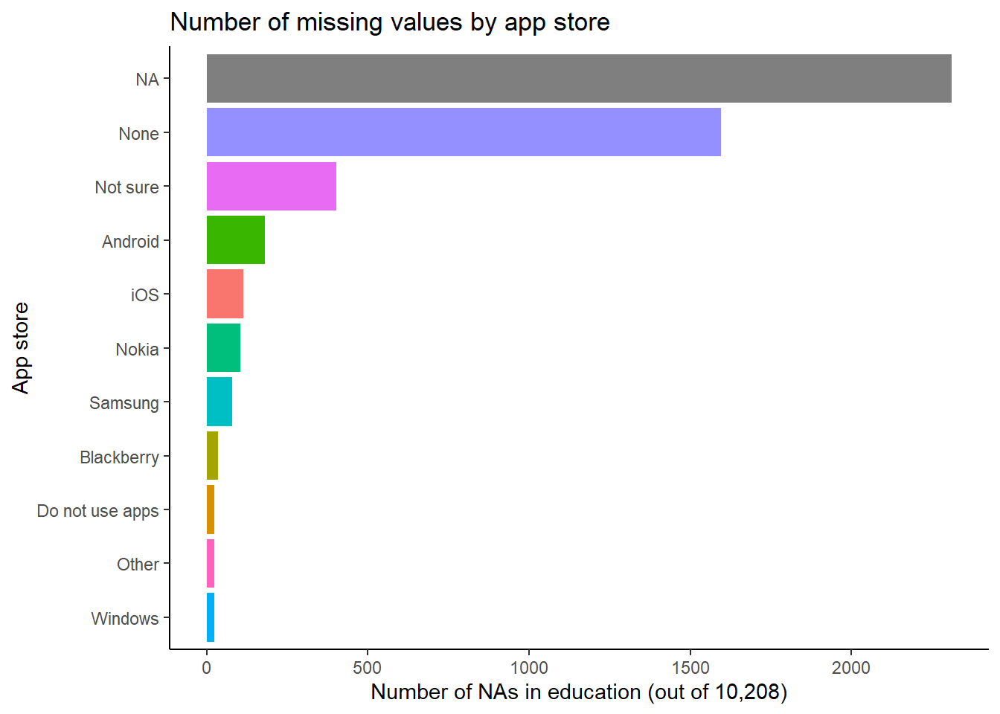
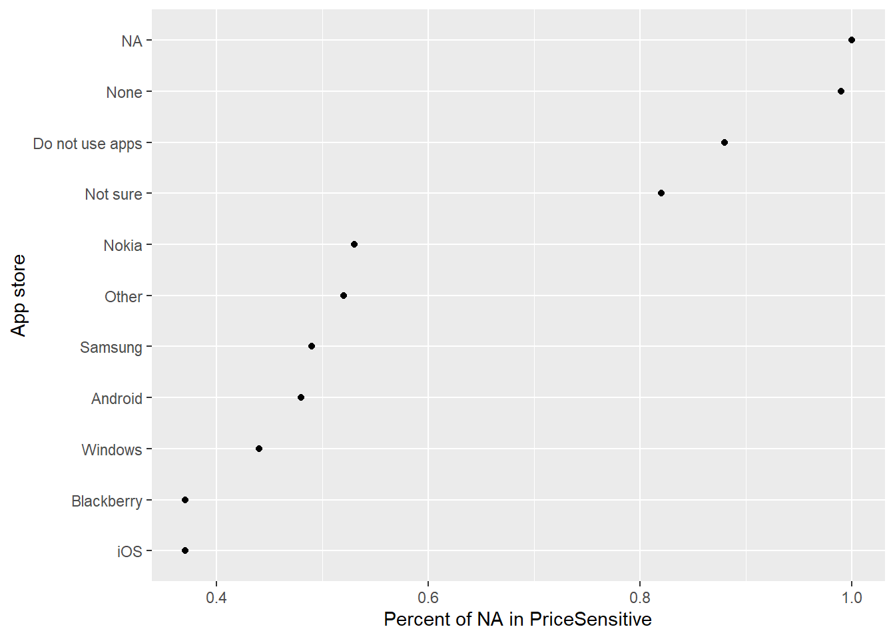
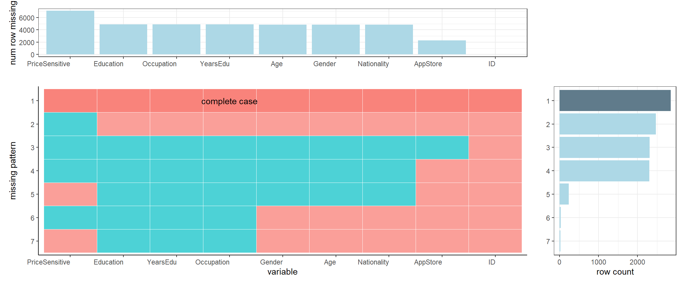

# Missing values

In this section, we will look at the patterns in missing data. We expect to have many missing values in this `Mobile App User Dataset` as the data are collected from a survey where respondents may skip questions that they prefer not to answer. 

```{r}
library(tidyverse)
library(readxl)
library(patchwork)
library(ggplot2)
```

```{r echo=TRUE}
# import data
app_data = read_excel("data/mobile_app_user_dataset_1.xlsx")
```

```{r echo=TRUE}
# choose columns we need for the project
app_user = app_data[-1,] %>%
  select(ID, Q4, Q9_8, Q16, Q17, Q19, Q23, Q24, Q27) %>%
  rename(AppStore = Q4,
         PriceSensitive = Q9_8,
         Gender = Q16,
         Age = Q17,
         Nationality = Q19,
         Education = Q23,
         YearsEdu = Q24,
         Occupation = Q27)
```

## Column pattern

```{r echo=TRUE}
# Missing values by column sum
colSums(is.na(app_user[,-1])) %>% sort(decreasing = TRUE)
```

Here, we define `PriceSensitive` as people who took price into consideration when choosing apps to download (those who chose *Price* in Q9). On the other hand, NAs in this column represent people who skipped the question or those who didn't choose *Price* for the question. In addition to 7,104 missing values in `PriceSensitive`, 4,892 people didn't reply to education, years of education and occupation, while 4,842 values are missing for gender, age and nationalities. It also shows that 2,310 people skipped the question of "which app store do you use?" in the survey.

## Value patterns

### Missing values by app store

```{r echo=TRUE}
# rename the levels
app_user = app_user %>%
  mutate(AppStore = fct_recode(AppStore,
                               iOS = "1",
                               Blackberry = "2",
                               Android = "3",
                               Nokia = "4",
                               Samsung = "5",
                               Windows = "6",
                               None = "7",
                               `Not sure` = "8",
                               Other = "9",
                               `Do not use apps` = "10"
                               )) %>%
  mutate(AppStore = as.factor(AppStore))

# missing values by app store
missing_appstore = app_user %>%
  group_by(AppStore) %>%
  summarise_all(~sum(is.na(.))) %>%
  select(-ID, -PriceSensitive)
missing_appstore
```

When we group the data by different App stores, some missing data appear to be highly correlated: `Gender`, `Age` and `Nationality` share the same patterns of missing values, while `Education`, `YearsEdu` and `Occupation` have exact same numbers of NAs in each App store. This shows that respondents who didn't answer education-related questions also skipped the one for occupation. People who prefer not to answer their genders and ages avoided answering nationalities too.

```{r echo=TRUE}
# bar plot for edu
ggplot(missing_appstore, aes(x = fct_reorder(AppStore, Education), y = Education, fill = AppStore)) +
  geom_col() +
  ggtitle("Number of missing values by app store") +
  xlab("App store") +
  ylab("Number of NAs in education (out of 10,208)") +
  coord_flip() +
  theme_classic() +
  theme(legend.position = "none") 
```



If we visualize missing values of `Education` by App store, we can see that the largest number of NAs in education appears in the group NA in App store. We should consider removing these NAs since they have little information for both variables. 

### Missing values by app store & price sensitivity

```{r}
# percent missing of PriceSensitive by AppStore
app_store = app_user %>%
  group_by(AppStore) %>%
  summarize(num_appstore = n(), num_na = sum(is.na(PriceSensitive))) %>%
  mutate(pct_na = round(num_na/num_appstore, 2)) %>%
  arrange(-pct_na)
app_store
```


```{r echo=TRUE}
# visualization of the above
ggplot(app_store, aes(pct_na, reorder(AppStore, pct_na, mean))) +
  geom_point() +
  ylab("App store") +
  xlab("Percent of NA in PriceSensitive")
```



All people who skipped writing down their App stores have an NA in `PriceSensitive`. People using iOS (Apple Store) appear to have the smallest number of missing values for the price question, so they are the most price-sensitive. We can also see that Android/Google and Samsung market users have similar percentages of NAs.

## Missing values by variable

```{r}
# given dataset, find and count missing pattern
find_missing_pattern <- function(dataset, percent = TRUE){
  missing_patterns <- data.frame(is.na(dataset)) %>%
  group_by_all() %>%
  count(name = "count", sort = TRUE) %>%
  ungroup()
  
  if(percent){
    missing_patterns$count <- (missing_patterns$count/sum(missing_patterns$count))*100
  }
  
  missing_patterns["pattern"] <- factor(rownames(missing_patterns), levels = sort(as.numeric(rownames(missing_patterns))))
  missing_patterns["complete"] <- as.character(rowSums(missing_patterns[,1:(ncol(missing_patterns)-2)]) == 0)
  
  return(missing_patterns)
}

# given dataset, count rows of NA per col
find_missing_row <- function(dataset, percent = TRUE){
  if(percent){
    missing_row <- data.frame(sort((colSums(is.na(dataset))/nrow(dataset))*100, decreasing = TRUE))
  }else{
    missing_row <- data.frame(sort(colSums(is.na(dataset)), decreasing = TRUE))
  }
  missing_row <- rownames_to_column(missing_row, "col_name")
  colnames(missing_row)[2] <-  c("missing_row_count")
  
  column_level_by_count <- missing_row$col_name
  result <- list("missing_row" = missing_row, "column_level_by_count" = column_level_by_count)
  
  return(result)
}

# make missing pattern plot (main plot)
plot_missing_pattern <- function(dataset, percent = TRUE, rotate_x = 0){
  # generate dataframes
  missing_patterns <- find_missing_pattern(dataset, percent)
  res <- find_missing_row(dataset,percent)
  missing_row <- res$missing_row
  level <- res$column_level_by_count
  
  
  # parameter setup 
  cut_off <- ncol(missing_patterns)-3
  layout <- c(
    area(1, 1, 1, 2),
    area(2, 3, 3),
    area(2, 1, 3, 2)
    )
  
  # set coordinates for complete case
  y_coord <- missing_patterns[,c("pattern", "complete")] %>%
    filter(complete == "TRUE") %>%
    select("pattern")
  y_coord <- max(as.numeric(missing_patterns$pattern)) - as.numeric(y_coord) + 1
  x_coord <- round(cut_off/2)
  
  df <- pivot_longer(missing_patterns, cols = 1:cut_off, names_to = "type", values_to = "not_missing")
  upper_bound <- ncol(df)
  df <- df[,2:upper_bound]
  df$type <- factor(df$type, levels = level)
  
  # generate side plots and main plot
  p1 <- ggplot(missing_patterns) +
    geom_col(aes(x = fct_rev(pattern), y = count,  fill = complete))+
    scale_fill_manual(values=c("lightblue", "lightskyblue4") ) +
    xlab("")+
    ylab(ifelse(percent, "% rows", "row count"))+
    ylim(0, ifelse(percent, 100, NA))+
    theme_bw()+
    theme(legend.position = "none")+
    coord_flip() 

  p2 <- ggplot(missing_row) +
    geom_col(aes(fct_reorder(col_name, missing_row_count, .desc = T), missing_row_count), fill = "lightblue")+
    xlab("")+
    ylab(ifelse(percent, "% row missing", "num row missing"))+
    ylim(0, ifelse(percent, 100, NA))+
    theme_bw()+
    theme(axis.text.x = element_text(angle = rotate_x, hjust = 1))

  p3 <- ggplot(df,aes(type, fct_rev(pattern))) +
    geom_tile(aes(fill = not_missing, alpha = complete), colour = "white") +
    scale_alpha_manual(values=c("TRUE" = 0.9, "FALSE" = 0.7) ) +
    xlab("variable") +
    ylab("missing pattern")+
    annotate("text", x = x_coord, y = y_coord, label = "complete case") +
    theme_classic()+
    theme(legend.position = "none", axis.text.x = element_text(angle = rotate_x, hjust = 1))
  
  return(p2 + p1 + p3 + plot_layout(design = layout, heights = c(2,5), widths = c(1, 1, 0.5)))
}
```

```{r echo=TRUE, fig.width=12}
# plot
plot_missing_pattern(dataset = app_user, percent = FALSE)
```



The most obvious pattern is the complete case (no NA in any column), indicating that over 2,500 observations contain all the information we need. The second most frequent missing pattern appears in the `PriceSensitive` column. It is interesting that many people didn't provide any of their personal information in the survey, as we can see from the third, fourth & fifth patterns.
